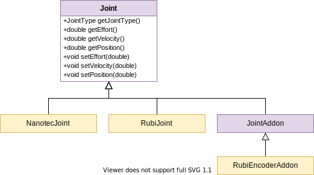

# aleph2_hardware_interface
This package provides an abstraction layer over the hardware running on Aleph2 that can be used with the [ros_control] framework. Although the abstraction was
created specifically for the Aleph2 robot, its implementation is fully robot-agnostic and can be used with any configuration of the supported hardware.

## Libraries

* **`aleph2_joint`**

    Provides a set of classes that allow exposing capabilities of hardware controlling the robot’s joints, via a common interface.

    

    **Joint** − An abstract class that provides a common interface for exposing capabilities of various joint types.
    
    **NanotecJoint** − A derived class that exposes capabilities of a joint controlled by a Nanotec motor driver. Apart from implementing the Joint interface, it provides dynamically reconfigurable parameters (see [dynamic_reconfigure]) which allow to set the motor’s power and passive brakes.
    
    **RubiJoint** − A derived class that exposes capabilities of a joint controlled by a RUBI-enabled board. It can implement any subset of the Joint interface by specifying only selected RUBI fields. If home field is specified, it creates a service which enables homing functionality for a joint.

    **JointAddon** − A base class for extending or modifying joint’s capabilities. It uses a decorator design pattern to overwrite the behavior of certain functions from the `Joint` interface.

    **RubiEncoderAddon** − A derived class that represents a RUBI-enabled position sensor. It overwrites the `getPosition()` method of a `Joint` instance.
 
* **`aleph2_hw`**

    Provides the `Aleph2HW` class which implements `RobotHW` interface for the `ros_control` framework. Upon initialization, it reads the hardware configuration from the Parameter Server, creates corresponding `Joint` instances, creates state and command handles for the joints and registers hardware interfaces. A sample configuration which explains the joint specification read by the `Aleph2HW` class can be found in the `config/template.yaml` file.

## Nodes

* **`control_loop`**

    Initializes `Aleph2HW` instance, creates a Controller Manager instance and starts a control loop for the `ros_control` framework. In each loop cycle, it reads the data from the hardware, updates all active controllers and writes commands to the hardware.

    ### Published topics:

    * **`~usage`** (type: [std_msgs/Float32])

        The percentage of the expected cycle time used. Calculated and published at the end of each cycle.

    ### Parameters

    * **`~loop_rate`** (`int`, default: `20`)

        Frequency (in Hz) at which the control loop is operating.

    * **`~spinner_threads`** (`int`, default: `4`)

        The number of threads used to asynchronously process callbacks from ROS subscribers.

    * **`~hw_namespace`** (`string`)

        If set, `Aleph2HW` and Controller Manager will use a relative namespace for ROS node handles.

    The node will also spawn additional topics and services used by the Controller Manager, loaded controllers and `Aleph2HW` joints.

[ros_control]: http://wiki.ros.org/ros_control
[dynamic_reconfigure]: http://wiki.ros.org/dynamic_reconfigure
[std_msgs/Float32]: http://docs.ros.org/en/api/std_msgs/html/msg/Float32.html